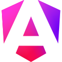
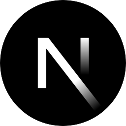
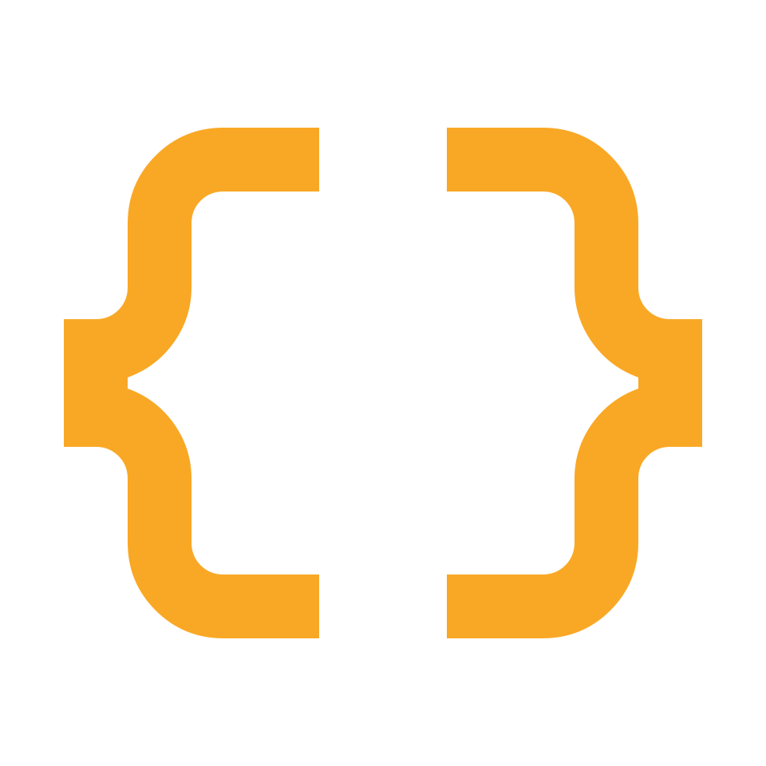
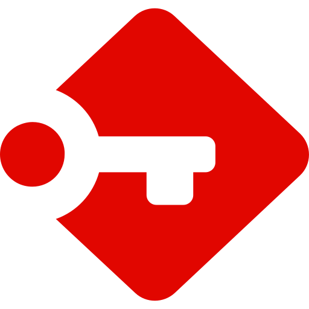
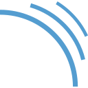
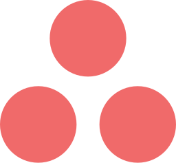

<!-- Gif Banner -->

<!-- Animation Text Loading -->

 
    

    <em>4+ Years of Experience in software development at <a href="https://www.rjcsoft.it/">RjcSoft s.r.l</a></em>
     

<!-- Badge Preview -->

  
  
  

<!-- Badge Contact -->

    
    
    

<!-- Description text -->

    

        Full-Stack software developer with expertise in mobile, web development and backend system. I focus on creating efficient and scalable applications using modern technologies. Let's build something amazing together!
    

<!-- Gradient Animation -->

    

<!-- Animation Text Loading -->

 
    

> Frameworks & languages that I like to work with.
<!-- Technical Stack Section -->
<table>
  <tr>
    <td align="center" width="96">
      
       HTML5
    </td>
    <td align="center" width="96">
      
       Angular
    </td>
    <td align="center" width="96">
      
       CSS3
    </td>
    <td align="center" width="96">
      
       Javascript
    </td>
    <td align="center" width="96">
      
       Next.js
    </td>
    <td align="center" width="96">
      
       React Native
    </td>
    <td align="center" width="96">
      
       PHP
    </td>
    <td align="center" width="96">
      
       Typescript
    </td>
  </tr>
  <tr>
    <td align="center" width="96">
      
       Springboot
    </td>
    <td align="center" width="96">
      
       JQuery
    </td>
    <td align="center" width="96">
      
       NPM
    </td>
    <td align="center" width="96">
      
       Android
    </td>
    <td align="center" width="96">
      
       Java
    </td>
    <td align="center" width="96">
      
       XML
    </td>
    <td align="center" width="96">
      
       JSON
    </td>
    <td align="center" width="96">
      
       Swagger UI
    </td>
  </tr>
</table>
 

> Used Tools & Technologies

<table>
    <tr>
        <td align="center" width="96">
            
             bruno
        </td>
        <td align="center" width="96">
            
             VSCode
        </td>
        <td align="center" width="96">
            
             Passbolt
        </td>
        <td align="center" width="96">
            
             Intelij
        </td>
        <td align="center" width="96">
            
             Figma
        </td>
        <td align="center" width="96">
            
             SonarQube
        </td>
        <td align="center" width="96">
            
             Gitlab
        </td>
        <td align="center" width="96">
            
             Jira
        </td>
      </tr>
      <tr>
        <td align="center" width="96">
            
             Tailwind
        </td>
        <td align="center" width="96">
            
             PrimeNG
        </td>
        <td align="center" width="96">
            
             Firebase
        </td>
        <td align="center" width="96">
            
             Sourcetree
        </td>
        <td align="center" width="96">
            
             Postman
        </td>
        <td align="center" width="96">
            
             Hostinger
        </td>
        <td align="center" width="96">
            
             JWT
        </td>
        <td align="center" width="96">
            
             Asana
        </td>
    <tr>
</table>
 
<!-- Gif Banner -->

<!-- Gradient Animation -->

    

 
  Thank you for visiting my Profile!

